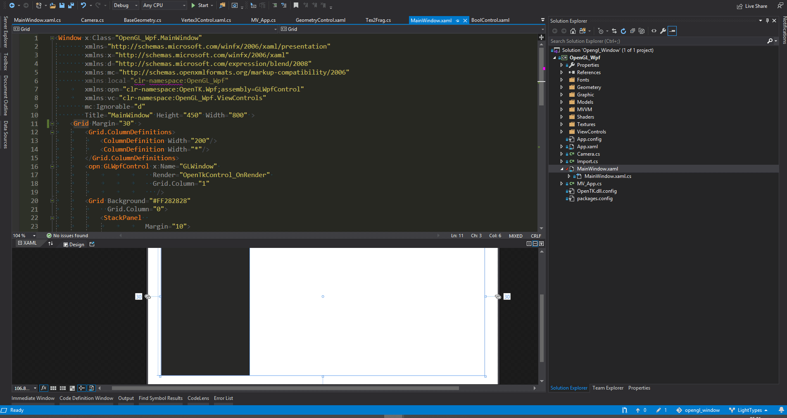

# OpenGL_CSharp
Self Study OpenGL based on OpenTK

I could not find a way to make stensil happen... Check Stensil Branch. Help/Advice is needed

**Controls:**
<ol>
  <li>AWSD => Left, Top, Down, Right</li>
  <li>Mouse Middle Click => Pan</li>
  <li>Mouse Scroller => Zoom In/Out</li>
  </ol>

